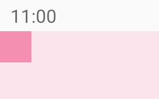

# InsetsHelper


Handle window insets with XML only. Say goodbye to writing `OnApplyWindowInsetsListener`.

## Download

```groovy
dependencies {
    implementation "dev.rikka.rikkax.insets:insets:1.1.1"
}
```

## Usage

### Setup factory2

If you are already using `MaterialActivity` from `dev.rikka.rikkax.material:material`, nothing needs to be done.

If you want to use this library only, you need to do some things:

<details>
  <summary>Click to expand</summary>

This library requires custom attributes for all views, including framework views, a special `LayoutInflater.Factory2` is required. We have a library `dev.rikka.rikkax.layoutinflater:layoutinflater` ([learn more](https://github.com/RikkaApps/RikkaX/tree/master/layoutinflater)).

An example implementation:

```kotlin
// Call in Activity#onCreate
layoutInflater.factory2 = LayoutInflaterFactory(delegate).addOnViewCreatedListener(WindowInsetsHelper.LISTENER)
```
</details>

### Use InsetsHelper

First lets create a very simple layout. We can see that the square shows below the status bar.



```xml
<?xml version="1.0" encoding="utf-8"?>
<FrameLayout xmlns:android="http://schemas.android.com/apk/res/android"
    xmlns:app="http://schemas.android.com/apk/res-auto"
    android:layout_width="match_parent"
    android:layout_height="match_parent"
    android:background="#FCE4EC"
    android:orientation="vertical">

    <View
        android:layout_width="24dp"
        android:layout_height="24dp"
        android:layout_gravity="start"
        android:background="#F48FB1" />

</FrameLayout>
```

Then add `app:edgeToEdge="true"` to the `FrameLayout`, we can see that the status bar now floats on the square.


Note, to make the status bar and navigation bar transparent, you need to add these attributes to your theme.

```xml
<item name="android:statusBarColor">@android:color/transparent</item>
<item name="android:navigationBarColor">@android:color/transparent</item>
<item name="android:enforceNavigationBarContrast">false</item>
<item name="android:enforceStatusBarContrast">false</item>
```

Finally, add `app:fitsSystemWindowsInsets="top"` to the `FrameLayout`. We can see that the `FrameLayout` has a top padding whose the size is the height of the status bar.


**In the actual usage scenario, you need to add different attributes (`fitsSystemWindowsInsets` and `layout_fitsSystemWindowsInsets`) for different views according to your situation.**

### Attributes

Attribute                 | Type                                      | Description
--------------------------|-------------------------------------------|--------------------------------------------------------------------------------------------------------------------------------
`edgeToEdge`              | `boolean`                                 | If the view requires "Edge-to-edge", show contents below system bars. Usually this attribute needs to be set for the root view.
`fitsSystemWindowsInsets` | `flags` [1] | Add specified insets as padding for this view.
`layout_fitsSystemWindowsInsets` | `flags` [1] | Add specified insets as margin for this view.
`consumeSystemWindowsInsets` | `flags` [1] | Consume specified insets, so that the insets will not be passed to child views.

[1] Values: `top|bottom|left|right|start|end`

### Change padding and margin at runtime

In actual usage scenario, there may be more complex requirements. For example, you need to change the padding of the views. You need to use our methods to change the padding and the margin, or the insets may be added multiple time.

Also, **DO NOT** use DataBinding to change padding and margin since DataBinding runs "one frame later", so that it will overwrite values set by InsetsHelper.

```kotlin
val View.initialPaddingLeft: Int
val View.initialPaddingTop: Int
val View.initialPaddingRight: Int
val View.initialPaddingBottom: Int
val View.initialPaddingStart: Int
val View.initialPaddingEnd: Int
fun View.setInitialPadding(left: Int, top: Int, right: Int, bottom: Int)
fun View.setInitialPaddingRelative(start: Int, top: Int, end: Int, bottom: Int)

val View.initialMarginLeft: Int
val View.initialMarginTop: Int
val View.initialMarginRight: Int
val View.initialMarginBottom: Int
val View.initialMarginStart: Int
val View.initialMarginEnd: Int
fun View.setInitialMargin(left: Int, top: Int, right: Int, bottom: Int)
fun View.setInitialMarginRelative(start: Int, top: Int, end: Int, bottom: Int)
```

To use these methods with Java, use `WindowInsetsHelperKt`.

## Changelog

### 1.2.0 (2022-01-30)

* Add reference support for attributes

### 1.1.0 (2021/05/17)

* Add the missing "s" to the attribute `fitsSystemWindowsInsets` and `layout_fitsSystemWindowsInsets`

  This is a breaking change, but the user only needs to replace all "fitSystemWindowsInsets" with "fitsSystemWindowsInsets".

  If you are also using `dev.rikka.rikkax.material:material-chooser`, since it depends on the library, you should upgrade to `1.4.0` or above.

* Fix the problem that `setInitialMargin` actually changes padding
* Fix `setInitialPaddingRelative` does not handle RTL correctly
